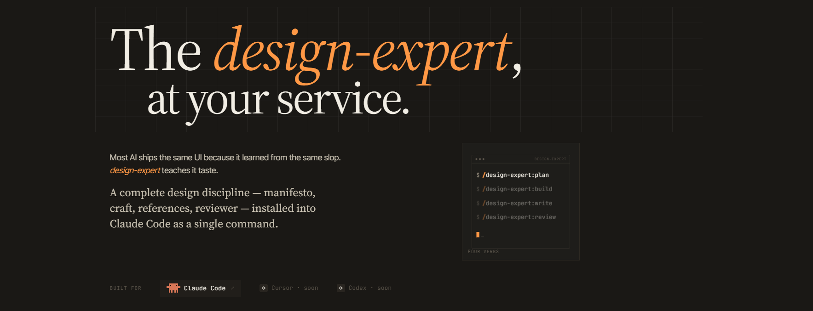

# design-expert

> **The latest features, live screenshots, and the freshest updates live on the website:** [**khevin.com/design-expert.html**](https://khevin.com/design-expert.html). The site is kept fully up-to-date — this README mirrors the canonical source, but the website ships first.

A paragraph-first, evidence-grounded skill for interface design. Build, review, plan, and write UI with the discipline of NNg heuristics, the Universal Design seven principles, IBM Carbon, anti-AI-slop patterns, a 32-pattern layout catalog, register-aware style files (editorial / expressive), voice taxonomies (UX copy / long-form / marketing-by-ad-lord), end-of-work self-review, and a curated 17-designer pantheon.

> Design is felt, not enforced. The principles in this skill exist not to constrain but to liberate — when the floor is solid, the ceiling lifts.

---

## Install

design-expert ships as a Claude Code plugin under the **khev-tools** marketplace. Two slash commands — one to add the marketplace via its HTTPS GitHub URL, one to install the plugin — run in sequence, and the four `/design-expert` commands appear in your `/` menu. If you'd rather click than type, run `/plugin` by itself for an interactive Discover & Install panel. Requires a current Claude Code build (run `claude --version`; update via Homebrew, npm, or the native installer if `/plugin` isn't recognized).

### Step 01 · Install

Two slash commands, run in sequence. The first registers the khev-tools marketplace via its HTTPS GitHub URL — the `owner/repo` shorthand resolves to SSH and fails without keys. The second installs design-expert from that marketplace. Restart the session afterwards so the four `/design-expert` commands register.

```bash
$ /plugin marketplace add https://github.com/Khevin/khev-tools
# clones over HTTPS · no SSH key required

$ /plugin install design-expert@khev-tools
# SKILL.md loaded · 14 markdown files · 17 design-gods
```

> ✓ marketplace added · 1 plugin available
> ✓ design-expert installed
> ✓ `/design-expert:plan` · `:build` · `:write` · `:review`

### Step 02 · First run

A brief, then a build, then a review. Each command writes to disk — `PRODUCT.md` + `DESIGN.md` from `/plan`, source files from `/build`, scored notes from `/review` — so you can read what the skill thinks before it ships code.

```bash
$ /design-expert:plan a billing-settings page for a subscription SaaS
# writes PRODUCT.md + DESIGN.md · audience, register, tokens, restrictions

$ /design-expert:build billing-settings from PRODUCT.md + DESIGN.md
# reads SKILL.md + the two briefs · ships components in src/billing/

$ /design-expert:review src/billing/
```

> ✓ scored against 10-lens framework · 6 notes · 0 blockers

---

## Commands — Four verbs. A shared vocabulary.

### `/design-expert:plan` — Plan the design first.

Discovery before pixels. Audience, register, brand voice, anti-references — captured as a brief the rest of the work reads. Stops the model from one-shotting a generic mock.

```bash
$ /design-expert:plan checkout flow for a calm clinical SaaS
```

### `/design-expert:build` — Build it on the bar.

From brief to real screens, real components, real type. Reads your tokens, respects your system, ships code — not a Figma mock the model can't render.

```bash
$ /design-expert:build pricing page from PRODUCT.md + DESIGN.md
```

### `/design-expert:write` — Write copy that holds.

Display lines, microcopy, error states, empty states — written in the voice the brief committed to, not in default-AI breeziness.

```bash
$ /design-expert:write hero for a calm clinical SaaS
```

### `/design-expert:review` — Review with a real reviewer.

The work gets walked, scored against the foundations, and graded. The reviewer cites the principle behind every note — no vibes-based feedback, no "looks great, ship it."

```bash
$ /design-expert:review src/pages/pricing.tsx
```

Plus the skill itself, invoked freely as `design-expert`.

---

## Updates

### v1.2.0 — May 3, 2026

- **Library + Pantheon popovers.** Tap any row in `02 — The Library` or any Pantheon card; a paper-card dialog lifts off the page. Four designers added; total seventeen.
- **Foundations expanded.** New `grids.md` (Swiss + asymmetric); new `layouts.md` (32 patterns by register); `craft.md` gains the iteration-sizing framework.
- **Register, layout, intent gates wired in.** `plan` opens with a register hard-ask; `build`'s gates 2, 3, 7, 10 enforce register, layout-catalog walk, aspect-ratio inventory, and asset-fit re-check. Per-surface `PRODUCT.md` + `DESIGN.md` naming is now standard.
- **New taxonomies + self-review + slop catalog.** `styles/` ships editorial and expressive; `voices/` ships ux-copy, long-form (Work&Co tone), and four marketing files by ad-lord (Lois, Bernbach, Gossage, Ogilvy). New `self-review.md` for end-of-work discipline. Impeccable's catalog folded into `anti-slop.md`.

### v1.0.0 — April 30, 2026

- **Initial plugin release.** Four commands — `plan`, `build`, `write`, `review` — backed by a 12-file markdown library and 13 designer-specific reference files in `design-gods/`.
- **Reviewer scores against ten lenses.** Foundations, hierarchy, type, color, composition, motion, copy, accessibility, anti-slop, brand fit. Each note cites the principle behind it.
- **PROJECT.md awareness.** Per-project overrides — audience, brand voice, anti-references — read on every command. Drop one in your repo root.

### v0.9 · beta — April 22, 2026

- **anti-slop.md graduates.** 30+ named patterns the reviewer now flags on sight, each with a recommended replacement.
- **Brand vs product registers.** The skill picks before it generates — landing pages stop being critiqued for breaking dashboard conventions and vice versa.

### v0.5 · alpha — April 8, 2026

- **First public alpha.** SKILL.md + foundations + craft + a single review command. The reviewer was the seed; everything else grew around it.

---

## Voice

The skill is written paragraph-first, manifesto-style. Every file leads with WHY before HOW. Bullets, tables, and ASCII diagrams complement paragraphs — they do not replace them.

The canonical voice reference is the `interface-design` plugin by Damola Akinleye, which design-expert evolves alongside.

---

## Hard rules (non-negotiable)

- No emojis as UI — one consistent icon library
- IBM Carbon defaults for enterprise / dense data UIs
- No pie or donut charts (Cleveland & McGill 1984)
- `prefers-reduced-motion: reduce` is mandatory
- 44×44 px minimum touch targets (WCAG 2.5.5)
- Native `<dialog>` + `inert` for modals
- Validate on blur, never on keystroke or submit
- Never use humor for failures, errors, or destructive confirmations

---

## Sources

design-expert is a standalone evolution of three predecessor skills:

- **`nng-agent`** — Nielsen Norman Group heuristics, Universal Design 7, anti-defaultism, IBM Carbon, font pairings, decision checklist, review template, confidence framework, data-viz tree
- **`interface-design`** by [Damola Akinleye](https://github.com/Dammyjay93) — manifesto voice, Intent-First, swap/squint/signature/token tests, subtle layering
- **`impeccable`** by [Patrick Bakaus](https://github.com/pbakaus) — brand vs product register, 0–4 heuristic scoring, shape/teach/document workflow, ux-writing patterns

Plus original research on a curated 17-designer pantheon (Rams, Vignelli, Ive, Kare, Rand, Norman, Nielsen, Eames, Victor, Corum, Tufte, Cooper, Frere-Jones, Tschichold, Müller-Brockmann, Scher, Muriel Cooper), eight quality reference systems (Pentagram, IBM Carbon, Apple HIG, Linear, Stripe, Refactoring UI, Vignelli Canon, Material Design 3), the 32-pattern layout catalog, the editorial/expressive style taxonomy, and the four-flavor marketing voices folder.

---

## License

MIT — see [LICENSE](./LICENSE).
