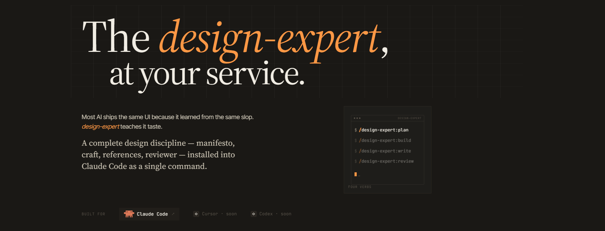

# design-expert

A paragraph-first, evidence-grounded skill for interface design. One command that plans, builds, reviews, iterates, and writes UI with the discipline of NNg heuristics, the Universal Design seven principles, anti-AI-slop patterns, a 32-pattern layout catalog, register-aware style files, voice taxonomies, self-review, and a eighteen-designer pantheon that sits as a council when the work is large enough to deserve one.

> Design is felt, not enforced. The principles in this skill exist not to constrain but to liberate: when the floor is solid, the ceiling lifts.

[khevin.com/design-expert.html](https://khevin.com/design-expert.html)

## Install

design-expert ships as a Claude Code plugin under the khev-tools marketplace. It needs a current Claude Code build; update if `/plugin` is not recognized.

```bash
/plugin marketplace add https://github.com/Khevin/khev-tools
/plugin install design-expert@khev-tools
```

## One command

Describe the work. The skill reads who you are, where the work will land, how the project's design system is implemented, how big the change is, and what you asked for, then it runs the right mode.

```bash
/design-expert a billing-settings page for a subscription SaaS
/design-expert make it better
/design-expert critique src/billing/, notes only
/design-expert the error when a payment fails to send
```

Force a mode when you already know which one you want: `/design-expert plan …`, `/design-expert build …`, `/design-expert review …`, `/design-expert write …`, `/design-expert iterate …`.

### How it decides

Every run prints one trace line before it works, so you can see each decision and correct it:

`Triage: role designer (profile) · handoff → developer · deploy figma-file · DS system.md + CLAUDE.md § tokens · register product · size iteration · mode iterate · target figma (prereq figma-use) · tier capsule`

- Who you are is asked once and remembered in `~/.claude/design-expert/profile.md`. The project's handoff direction, deploy target, Figma file, and design-system pointers live in `.design-expert/project.md`, safe to commit or ignore.
- The design system comes before any judgment. The skill looks in briefs, `system.md`, `CLAUDE.md` token sections, tokens in code, component folders, Figma variables and libraries, and Claude Design projects, and asks how the system is implemented only when it finds nothing. A pattern your system mandates is never filed as slop.
- The size of the change is read from its scope, not its phrasing. Touch-up, polish, iteration, surface redesign, system redesign. "Make it better" on a button is polish; on a dashboard it is iteration.
- The output target follows the role. Designers with Figma connected work in Figma for concepts and build. Everyone else sees concepts on the Claude Design canvas and builds in code or briefs. Small changes never open a surface.
- The pantheon is a council. Plan convenes all eighteen designers as parallel seats, each reading only its own file; a chair turns their verdicts into rulings, contested points you are asked about, and recorded dissent. Redesigns and full reviews convene a room seated by the surface's tags. Medium work gets a capsule consultation. Trivial work gets none.

## Modes

**Plan** writes `PRODUCT.md`, `DESIGN.md`, and `DECISIONS.md` through a discovery interview, direction probes on your concept surface, the full council, a layout walk, and personas. Briefs stay within word budgets; dated decisions go to the decision log. It never overwrites a brief silently.

**Build** takes a brief to real screens through gates: shape, layout exploration, references, intent, domain, inventory, proposal, the council at redesign size, build on your target, iteration on the rendered result, then presentation and handoff. Every iterate request enters here at its size.

**Review** walks anti-defaultism with the mandated-pattern check first, the ten-lens checklist, Universal Design 7, Nielsen scoring, the five-dimension audit, the grid audit, hardening, distillation, and onboarding, and produces the eight-section document with citations. The council rules on the fixes at full depth.

**Write** produces copy in three contexts, UX micro-copy, long-form, and marketing, each in its voice file, and sweeps the result for the tells that turn copy into wallpaper.

## Updates

### v2.0.0, September 7, 2026

One entry point. `/design-expert` triages every request and picks the mode; the four sub-commands are gone. The pantheon became a council with parallel seats and a chair. The skill now discovers the project's design system before judging, remembers who you are and where the work lands, chooses Figma, canvas, or code by role, and hands off in the receiver's medium. Briefs gained word budgets and a `DECISIONS.md` log. Paula Scher, Alan Cooper, and Johannes Itten joined the pantheon. A ninth anti-slop category names the structural and rhetorical tells: numbered section markers, decorative side-stripes, fragment triads, reversal formulas, dash-label headers. The plugin follows the current `skills/` layout. Full notes in `CHANGELOG.md`.

### v1.2.0, May 3, 2026

Editorial and expressive style registers, the 32-pattern layout catalog, `grids.md`, iteration sizing in `craft.md`, `self-review.md`, the voices taxonomy with four marketing voices, register and layout gates in plan and build, per-surface brief naming.

### v1.0.0, April 30, 2026

Initial plugin release with four commands, a twelve-file reference library, and thirteen designer files.

### v0.9 beta, April 22, 2026

`anti-slop.md` graduated with thirty named patterns; brand and product registers separated.

### v0.5 alpha, April 8, 2026

First public alpha: `SKILL.md`, foundations, craft, and a single review command.

## Sources

design-expert is a standalone evolution of three predecessor skills:

- `nng-agent`: Nielsen Norman Group heuristics, Universal Design 7, anti-defaultism, IBM Carbon, font pairings, the decision checklist, the review template, the confidence framework, the data-viz tree.
- `interface-design` by [Damola Akinleye](https://github.com/Dammyjay93): manifesto voice, Intent-First, the swap, squint, signature, and token tests, subtle layering.
- `impeccable` by [Patrick Bakaus](https://github.com/pbakaus): brand vs. product register, 0–4 heuristic scoring, the shape, teach, and document workflow, ux-writing patterns.

Plus original research on the eighteen-designer pantheon (Rams, Vignelli, Ive, Kare, Rand, Norman, Nielsen, Eames, Victor, Corum, Tufte, Muriel Cooper, Frere-Jones, Tschichold, Müller-Brockmann, Scher, Alan Cooper, Itten), eight reference systems (Pentagram, IBM Carbon, Apple HIG, Linear, Stripe, Refactoring UI, the Vignelli Canon, Material Design 3), the layout catalog, the style taxonomy, the marketing voices, and the council protocol.

## License

MIT. See [LICENSE](./LICENSE).
